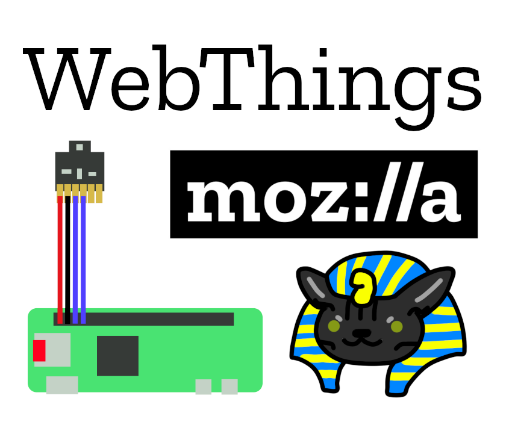

# Mozilla WebThings Weatherstation with Bosch BME680 Sensor

<h1>Things you will need for this Project!</h1>

<ul>
<li>Raspberry Pi Zero W(H)</li>
<li>Bosch BME680 Breakoutboard</li>
<li>Webthings Gateway</li>
</ul>
